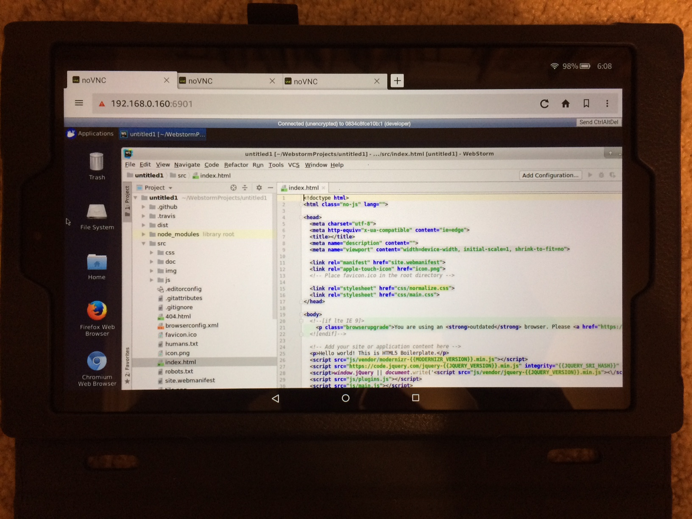
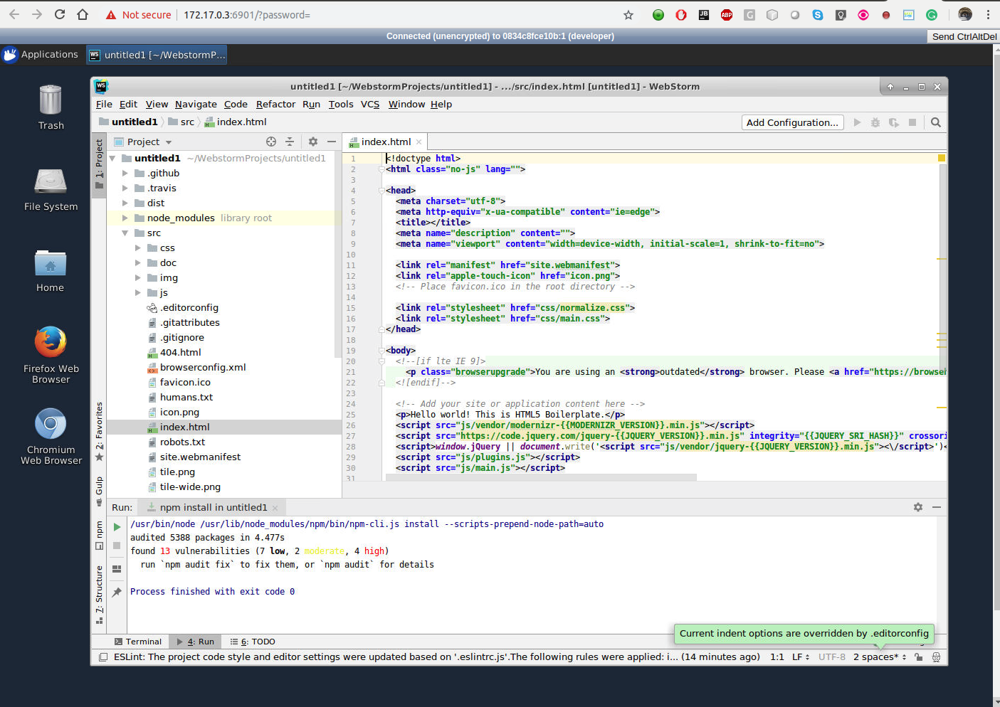

# WebStorm IDE in a Docker container + Java 8 (1.8.0_191) JDK + Maven 3.6 + Python 3.5 + PIP3 18.1 + npm 3.5.2 + nodejs v4.2.6 + Gradle 5.1 + noVNC/VNC (as Cloud-based Container Desktop)

[](https://microbadger.com/images/openkbs/webstorm-vnc-docker "Get your own image badge on microbadger.com") [](https://microbadger.com/images/openkbs/webstorm-vnc-docker "Get your own version badge on microbadger.com")

# Components:
* WebStorm version "2018.3"
* java version "1.8.0_201"
  Java(TM) SE Runtime Environment (build 1.8.0_201-b09)
  Java HotSpot(TM) 64-Bit Server VM (build 25.201-b09, mixed mode)
* Apache Maven 3.6.0
* Python 3.5.2
* npm 6.4.1 + node v10.15.0 (from NodeSource official Node Distribution)
* Gradle 5.1
* VNC/noVNC for remote Desktop over Container Platform (Openshift, Kubernetes, etc.)
* Other tools: git wget unzip vim python python-setuptools python-dev python-numpy 

## Requirements
* Docker 1.13.1+ or latest 17.12.1-ce 

# Run (recommended for easy-start)
Image is pulling from openkbs/webstorm-vnc-docker
```
./run.sh
```

## Mobile devices and Desktop PC supported / tested:
* SmartPhones: tested ok! iPhone5 Safari works though phone screen size being too small vs the desired HD 1920x1080. It should work across all the smartphones with HTML5-capable brwosers. Hence, to access with small phone screen, run with VNC_RESOLUTION=800x600 (or adjust it to fit your phone's screen size)
* Tablets: tested ok! Amazon Fire with noVNC works!. It should work across all the tablets with HTML5-capable brwosers.
.
* Desktop PC or MacBook: tested ok! It should work across all PCs Desktop with HTML5-capable brwosers. 

## Connect to VNC Viewer/Client or noVNC (Browser-based VNC)
* connect via VNC viewer localhost:5901, default password: vncpassword
* connect via noVNC HTML5 full client: http://localhost:6901/vnc.html, default password: vncpassword
* connect via noVNC HTML5 lite client: http://localhost:6901/?password=vncpassword

Once it is up, the default password is "vncpassword" to access with your web browser:
```
http://<ip_address>:6901/vnc.html,
e.g.
=> Standalone Docker: http://localhost:6901/vnc.html
=> Openshift Container Platform: http://<route-from-openshift>/vnc.html
=> similarly for Kubernetes Container Platform: (similar to the Openshift above!)
```

## Build
You can build your own image locally.

```
./build.sh
```
## Making plugins persist between sessions
If you run "./run.sh" instead of "docker-compose up", you don't have to do anything as below.

WebStorm configurations are kept on `$HOME/.WebStorm2018.1` inside the container, so if you
want to keep them around after you close it, you'll need to share it with your
host.

For example: (Version might be different - use run.sh instead)

```sh
docker run -ti --rm \

           -v $HOME/.WebStorm2018.3:/home/developer/.WebStorm2018.3 \
           -v `pwd`:/home/developer/workspace \
           openkbs/WebStorm-docker
```

# See Also - Other docker-based IDE
* [openkbs/docker-atom-editor](https://hub.docker.com/r/openkbs/docker-atom-editor/)
* [openkbs/eclipse-photon-docker](https://hub.docker.com/r/openkbs/eclipse-photon-docker/)
* [openkbs/eclipse-photon-vnc-docker](https://hub.docker.com/r/openkbs/eclipse-photon-vnc-docker/)
* [openkbs/eclipse-oxygen-docker](https://hub.docker.com/r/openkbs/eclipse-oxygen-docker/)
* [openkbs/intellj-docker](https://hub.docker.com/r/openkbs/intellij-docker/)
* [openkbs/intellj-vnc-docker](https://hub.docker.com/r/openkbs/intellij-vnc-docker/)
* [openkbs/knime-vnc-docker](https://hub.docker.com/r/openkbs/knime-vnc-docker/)
* [openkbs/netbeans10-docker](https://hub.docker.com/r/openkbs/netbeans10-docker/)
* [openkbs/netbeans](https://hub.docker.com/r/openkbs/netbeans/)
* [openkbs/papyrus-sysml-docker](https://hub.docker.com/r/openkbs/papyrus-sysml-docker/)
* [openkbs/pycharm-docker](https://hub.docker.com/r/openkbs/pycharm-docker/)
* [openkbs/scala-ide-docker](https://hub.docker.com/r/openkbs/scala-ide-docker/)
* [openkbs/sublime-docker](https://hub.docker.com/r/openkbs/sublime-docker/)
* [openkbs/webstorm-docker](https://hub.docker.com/r/openkbs/webstorm-docker/)
* [openkbs/webstorm-vnc-docker](https://hub.docker.com/r/openkbs/webstorm-vnc-docker/)

## Reference
* https://download.jetbrains.com/idea
* https://www.jetbrains.com/idea/
* https://www.jetbrains.com/webstorm/

# Releases information
```
root@1b69cb491038:/usr# ./printVersions.sh 
+ echo JAVA_HOME=/usr/java
JAVA_HOME=/usr/java
+ java -version
java version "1.8.0_201"
Java(TM) SE Runtime Environment (build 1.8.0_201-b09)
Java HotSpot(TM) 64-Bit Server VM (build 25.201-b09, mixed mode)
+ mvn --version
Apache Maven 3.6.0 (97c98ec64a1fdfee7767ce5ffb20918da4f719f3; 2018-10-24T18:41:47Z)
Maven home: /usr/apache-maven-3.6.0
Java version: 1.8.0_201, vendor: Oracle Corporation, runtime: /usr/jdk1.8.0_201/jre
Default locale: en_US, platform encoding: ANSI_X3.4-1968
OS name: "linux", version: "4.15.0-43-generic", arch: "amd64", family: "unix"
+ python -V
Python 2.7.12
+ python3 -V
Python 3.5.2
+ pip --version
pip 18.1 from /usr/local/lib/python3.5/dist-packages/pip (python 3.5)
+ pip3 --version
pip 18.1 from /usr/local/lib/python3.5/dist-packages/pip (python 3.5)
+ gradle --version

------------------------------------------------------------
Gradle 5.1.1
------------------------------------------------------------

Build time:   2019-01-10 23:05:02 UTC
Revision:     3c9abb645fb83932c44e8610642393ad62116807

Kotlin DSL:   1.1.1
Kotlin:       1.3.11
Groovy:       2.5.4
Ant:          Apache Ant(TM) version 1.9.13 compiled on July 10 2018
JVM:          1.8.0_201 (Oracle Corporation 25.201-b09)
OS:           Linux 4.15.0-43-generic amd64

+ npm -v
6.4.1
+ node -v
v10.15.0
+ cat /etc/lsb-release /etc/os-release
DISTRIB_ID=Ubuntu
DISTRIB_RELEASE=16.04
DISTRIB_CODENAME=xenial
DISTRIB_DESCRIPTION="Ubuntu 16.04.3 LTS"
NAME="Ubuntu"
VERSION="16.04.3 LTS (Xenial Xerus)"
ID=ubuntu
ID_LIKE=debian
PRETTY_NAME="Ubuntu 16.04.3 LTS"
VERSION_ID="16.04"
HOME_URL="http://www.ubuntu.com/"
SUPPORT_URL="http://help.ubuntu.com/"
BUG_REPORT_URL="http://bugs.launchpad.net/ubuntu/"
VERSION_CODENAME=xenial
UBUNTU_CODENAME=xenial

```

